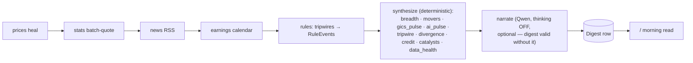
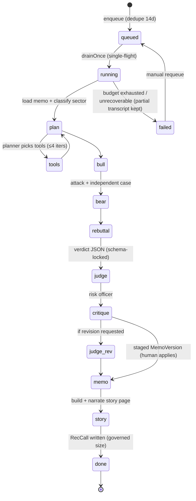
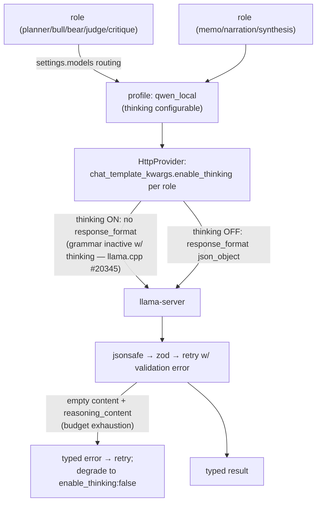

# ENGINE architecture

The unified local-first investment research platform. One machine, three processes,
zero cloud dependencies by default. This document describes the TARGET architecture
being built through EXEC_PLAN waves; sections note current status where relevant.

## System context

```mermaid
flowchart LR
    subgraph mac["Yash's Mac (single machine)"]
        WEB["Next.js web app<br/>(reads + light mutations)"]
        DAEMON["Scheduler daemon<br/>(all heavy writes: jobs,<br/>wake catch-up, dossier drain)"]
        LLAMA["llama-server :8000<br/>qwen3.6-27b Q8 MTP"]
        DB[("SQLite (WAL)<br/>data/engine.db")]
    end
    Y((Yash)) -->|morning read,<br/>queue dossiers,<br/>log buys| WEB
    WEB --> DB
    DAEMON --> DB
    DAEMON -->|completeJson<br/>(single-flight lock)| LLAMA
    DAEMON -->|throttled fetch| YF["Yahoo (via yahoo-finance2<br/>cookie+crumb session)"]
    DAEMON -->|"≤8 req/s, UA header"| EDGAR["SEC EDGAR"]
    DAEMON --> RSS["Google News RSS / Finnhub free"]
    Y -.->|paste-capture:<br/>Perplexity/Claude output| WEB
```

Principles: **deterministic-synthesis-first** (LLM narrates computed facts),
**provenance on every insight**, **despike at every read path**, **jobs never
crash**, **no broker code ever**, **local-first & model-swappable** (per-role
provider routing in `src/config/settings.ts`).

## Module map (src/)

| Module | Role | Key invariant |
|---|---|---|
| `analyst/` | LLM plumbing: jsonsafe → completeJson (zod + retry) → per-endpoint lock → HttpProvider | Every LLM call goes through completeJson under withLlmLock; content only, never reasoning_content |
| `config/` | providers (profiles + contextWindow + thinkingMode), settings (per-role routing), sectors (GICS 11 + AI-infra 12), tripwires | Provider/model swap = config change, never code |
| `lib/` | despike, metrics, universe CSV mapping | Bad ticks never become signal |
| `net/` | fetch wrappers + parsers + rate limiters (Yahoo, EDGAR) | Provider-decoupled: source tag + fallback chain |
| `db/` | node:sqlite store, migrations runner, queries, seed helpers | Additive hand-written SQL migrations only |
| `jobs/` | never-crash runner + backfill/stats/news/earnings/overnight | Catch per item; failures counted, not fatal |
| `rules/` | tripwire evaluators (injectable ctx, cooloff) → RuleEvent | Signals feed digest; no push paging |
| `research/` | deterministic digest synthesis (ranked insight families) | Every insight carries provenance |
| `tools/` | evidence substrate (ToolResult/ledger/budget/cache/registry) + quant tools (QoE, DCF, technicals, …) | Tools never throw; math in code, not LLM |
| `dossier/` | multi-agent debate state machine + queue | Resumable stages; uncited claims dropped; judge never crashes |
| `calibration/` | sizing governor + outcome horizons | Sizing trust is EARNED (5 resolved, ≥50% favorable) |
| `buylist/` | monthly $2,500 allocation | min(judge, governed) size; residual → cash |
| `capture/` | paste-capture render/parse/commit | The $0 web-research channel |
| `story/` | story-page composer + narration | Frozen data snapshot; page renders without LLM |

## Overnight/morning pipeline



Scheduling: launchd keeps the daemon alive; a wake detector (wall-clock drift) plus
`shouldCatchUp` runs the chain when the laptop opens in the morning window; a
same-market-date guard prevents duplicate digests. Dossier queue drains only when no
cron job is running.

## Dossier state machine (deep dive)



Every stage persists its output (`DossierStage`); a crashed/killed run resumes by
reusing done stages and rebuilding the evidence ledger from persisted `ToolCall`
rows. Budget = wall-clock + LLM-call + tool-call caps (USD removed). Evidence
context is capped per tool and trimmed lowest-confidence-first against the ACTIVE
profile's contextWindow.

## LLM contract (live-verified Jul 2, 2026)



Cloud profiles (Gemini/Anthropic/OpenAI-compat) exist as **connectivity-only
fallback** — never a silent quality substitute; validation failures retry the same
provider.

## Data stores (30-model Prisma schema, high level)

- **Universe:** Sector (dual taxonomy: `gics` base + `ai_infra` lens) · Ticker
  (source, watchlisted, cik) · TickerSector · SymbolOverride
- **Market data:** Price (10y daily, PK symbol+date) · FundamentalsQuarter ·
  EdgarFiling · NewsItem · Catalyst · ManualSeries · BackfillProgress
- **Signals/digest:** RuleEvent · Digest (dataJson + optional llm narration) · Brief
- **Research:** Dossier · DossierStage · ToolCall · ToolCacheEntry · Memo ·
  MemoVersion (staged→active, append-only) · EvidenceItem (unified: agent|tool|paste)
  · StoryPage (frozen storyJson) · DiscoveryCandidate · ScreenerConfig · Capture ·
  PromptTemplate
- **Capital:** RecCall (verdict + governed size + outcome horizons) · BuyList ·
  BuyListItem · Position · JournalEntry
- **Ops:** JobRun

SQLite in WAL mode, `busy_timeout` set; all heavy writers live in the daemon
process; bulk inserts are chunked `INSERT OR IGNORE` transactions.

## Design decisions & their evidence

| Decision | Why (evidence) |
|---|---|
| yahoo-finance2 for Yahoo transport | Live 429 throttling of naive fetch verified Jul 2; ENGINE's June backfill succeeded through it (crumb/cookie session) |
| Thinking toggle per role + budget-exhaustion handling | Live verification: empty-content failure mode + llama.cpp grammar-inactive-during-thinking |
| Short debate chain, stages checkpointed | TradingAgents' documented pain: token burn + information decay in long chains |
| Math in code, LLM narrates | ai-hedge-fund's documented failure: personas doing arithmetic hallucinate |
| Distillation (Living Memos) over RAG | Deliberate divergence from FinGPT-style RAG at single-user scale; revisit post-v1 |
| Read-once digest, no push | Owner's explicit prior decision (ENGINE removed paging); webhook = backlog, default off |
| Deterministic sizing governor | Market survey: LLM risk agents erode trust; code guardrails validated |

See `docs/research/market-scan.md` for the full survey with sources.
