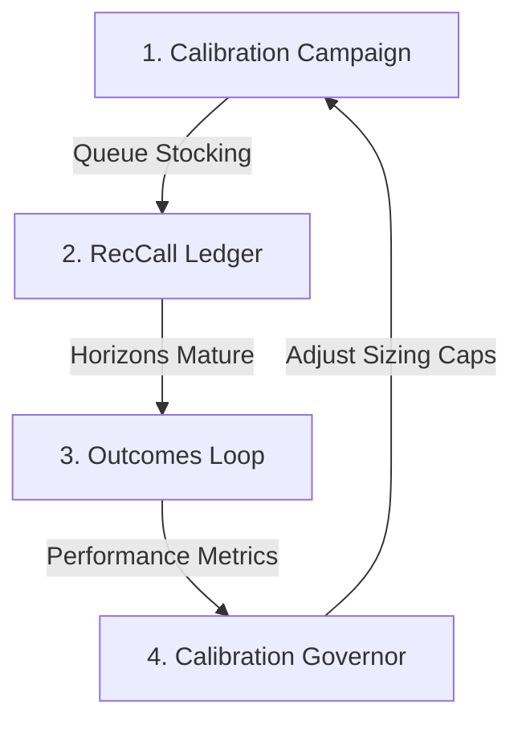

# Calibration & the Earned-Trust Governor

The **Calibration Governor** is ENGINE's central safety system. It treats all model recommendations as hypotheses that must be statistically proven over time before they are allowed to influence real capital allocations. This ensures the system does not deploy large amounts of money based on unproven prompt configurations or model profiles.

---

## The Calibration Loop

The system operates in a continuous four-part feedback loop:

### 1. Calibration Campaign
To evaluate a strategy, the system needs data. The **Calibration Campaign** ensures the system gets a steady flow of recommendations.
- **Command:** `npm run job -- campaign` (also runs automatically via the background scheduler daemon's idle-drain).
- **Behavior:** Keeps the dossier queue stocked with candidates by pulling symbols from:
  $$\text{Watchlist} \longrightarrow \text{AI Lens Sectors} \longrightarrow \text{GICS leaders}$$
- **Safety Limits:** The campaign is strictly **backlog-capped** to prevent runaway LLM usage.
- **Metadata Traceability:** Every recommendation call (`RecCall`) in the database is tagged with its active `promptVersion`. This ensures that subsequent prompt changes do not contaminate historical calibration statistics or slices.

### 2. RecCall Ledger
The database stores every generated verdict (BUY, HOLD, TRIM, AVOID), its conviction tier (HIGH, MEDIUM, LOW), the model's suggested size, the exact prompt configuration, and the timestamp.

### 3. Outcomes Loop
As time passes, the recommendations are evaluated against actual market movements.
- **Command:** `npm run job -- outcomes` (run periodically and integrated into the `overnight` pipeline).
- **Behavior:** Evaluates the `RecCall` ledger across four distinct horizons: **1-month (1m), 3-month (3m), 6-month (6m), and 1-year (1y)**.
- **Data Source:** To preserve privacy and performance, outcomes are resolved using **local daily closes** only (no external network requests).

### 4. Calibration Governor
The governor analyzes the outcomes to decide if a conviction tier has earned the right to have its sizing cap increased.

---

## Sizing Caps & the Earned-Trust Rules

By default, the governor restricts risk:

*   **Initial 2% Cap:** Every conviction tier starts with a hard cap of **2%** of capital. Regardless of how highly the local model's Judge sizes a position (up to 15%), it will be scaled down to 2% in the drafted buy-list.
*   **Requirements to Lift the Cap:** A conviction tier's cap is only lifted when:
    1.  It has accumulated **$\ge 5$ resolved calls**.
    2.  It has achieved a **$\ge 50\%$ favorable** resolution rate.

### Defining a Favorable Outcome

Favorable resolutions are defined strictly by target action:
*   **BUY:** Favorable if the price at the horizon is **greater** than the price at the call date.
*   **TRIM / AVOID:** Favorable if the price at the horizon is **less** than the price at the call date.
*   **HOLD:** Favorable if the price at the horizon remains within a tight **$\pm 2.5\%$** band of the price at the call date.

*Note: Sizing calibration evaluates these rules using the 3-month performance horizon. If a call has only matured to 1 month, the engine falls back to the 1-month data.*

---

## Reading the `/calibration` Page

Navigate to `http://localhost:3000/calibration` to review the track record. The page presents a transparent, real-time audit of the system's accuracy:

*   **Tier Summary Card:** Displays the active sizing cap, resolved call count, and current favorable rate for **HIGH**, **MEDIUM**, and **LOW** conviction tiers.
*   **Favorable Rate Progress Bar:** Visualizes how close each tier is to meeting or exceeding the 50% earned-trust threshold.
*   **Active vs. Resolved Counters:** Lists how many calls are currently running in the wild versus how many have matured and been resolved.
*   **Slices by Prompt Version:** Filters performance metrics by `promptVersion` or `modelProfile`. This lets you verify if a new model version or system prompt update is performing better or worse than the prior setup.
